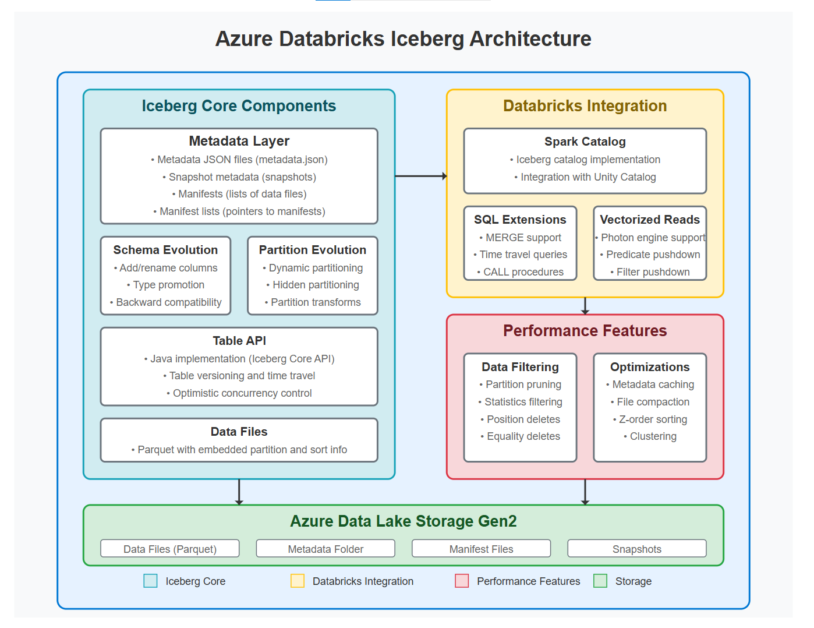
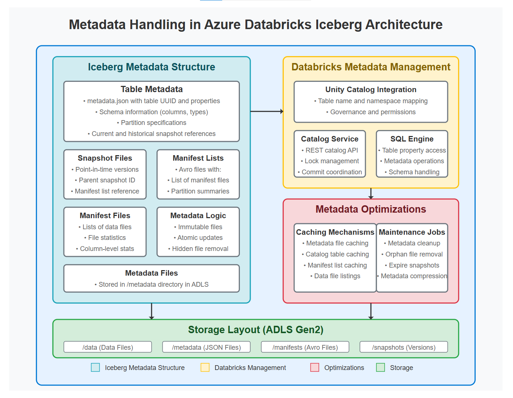
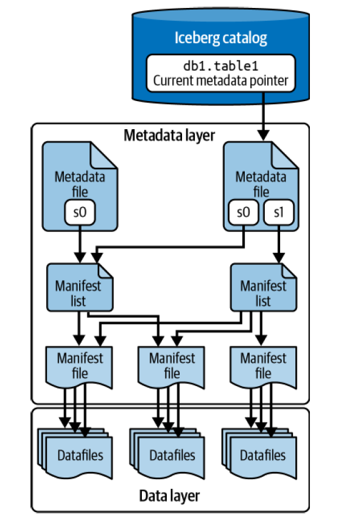
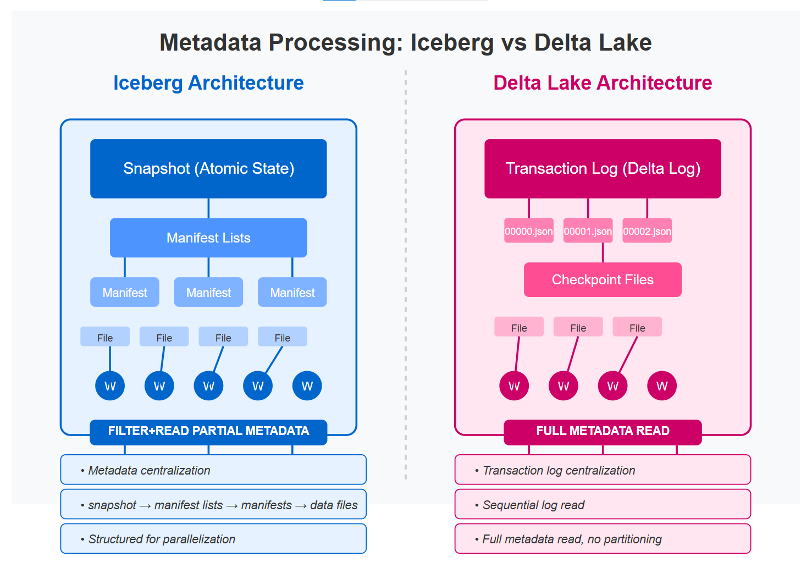
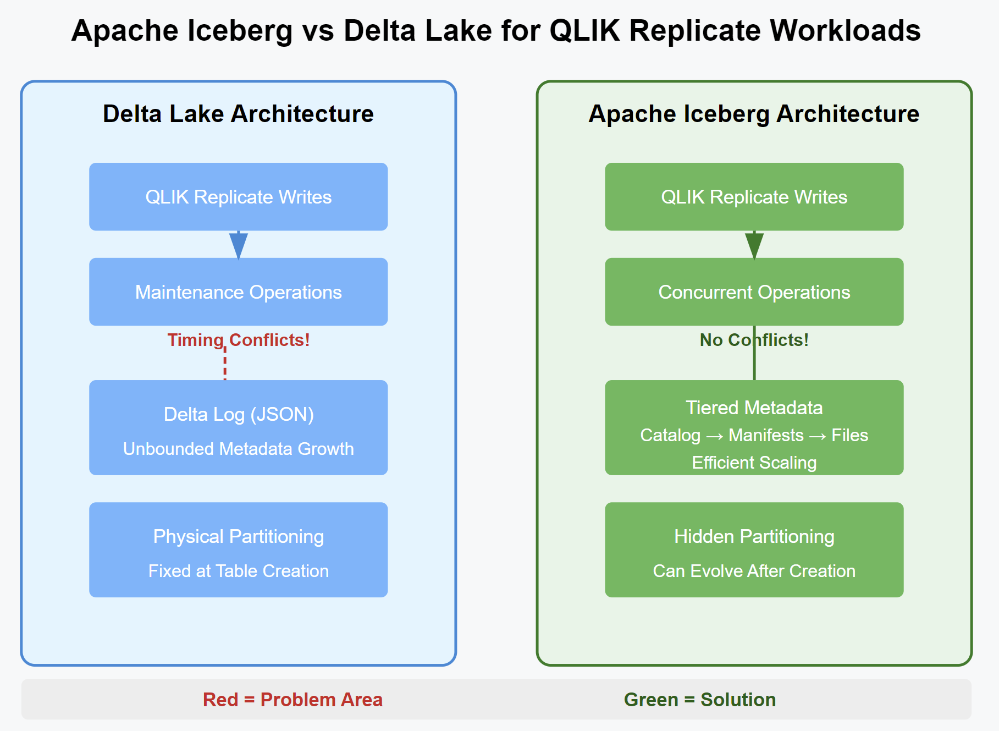
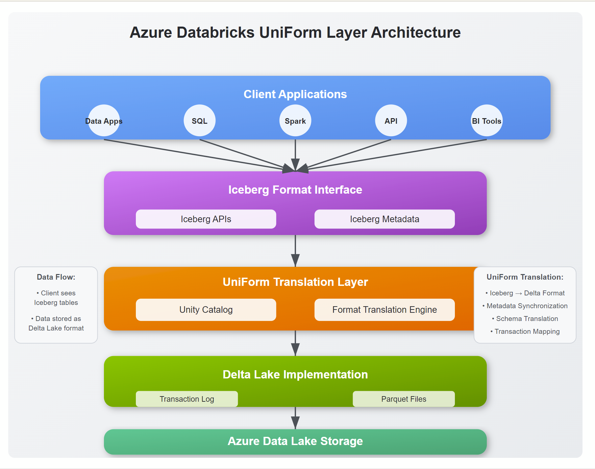

# Iceberg vs Delta Lake - Diagram Library

This directory contains architectural diagrams, metadata flow illustrations, performance concepts, and platform integration visuals used by the Iceberg vs Delta Lake article series.

---

## Diagram Index

### 01 - Iceberg Core Architecture

**File:** `01-iceberg-core-architecture.png`

Illustrates the major Apache Iceberg components:

- Metadata layer
- Schema evolution
- Partition evolution
- Table API
- Data files
- Databricks integration
- Performance features
- ADLS Gen2 storage layout

---

### 02 - Iceberg Metadata Management

**File:** `02-iceberg-metadata-management.png`

Shows how Azure Databricks manages Iceberg metadata:

- Table metadata
- Snapshots
- Manifest lists
- Manifest files
- Unity Catalog integration
- Metadata optimization services
- Storage organization

---

### 03 - Iceberg Catalog Metadata Flow

**File:** `03-iceberg-catalog-metadata-flow.png`

Detailed view of Iceberg's hierarchical metadata structure:

- Catalog pointers
- Metadata files
- Manifest lists
- Manifest files
- Data files

Demonstrates how Iceberg locates and accesses data without scanning a transaction log.

---

### 04 - Metadata Processing: Iceberg vs Delta Lake

**File:** `04-iceberg-vs-delta-metadata-processing.png`

Compares metadata access patterns:

#### Iceberg

- Snapshot-based architecture
- Hierarchical metadata
- Selective metadata reads
- Parallel metadata processing

#### Delta Lake

- Transaction log architecture
- Sequential log processing
- Full metadata reconstruction
- Checkpoint dependency

---

### 05 - Iceberg vs Delta Lake for QLIK Replicate

**File:** `05-iceberg-vs-delta-qlik-replicate.png`

Focuses on CDC workloads generated by QLIK Replicate.

Topics:

- Metadata growth
- Concurrent operations
- Maintenance conflicts
- Hidden partitioning
- Scalability characteristics

---

### 06 - Databricks UniForm Architecture

**File:** `06-databricks-uniform-layer.png`

Illustrates Databricks UniForm:

- Iceberg-compatible interface
- Metadata translation layer
- Unity Catalog integration
- Delta Lake storage implementation
- Multi-engine interoperability

---

## Related Articles

- ../README.md
- ../../README.md

---

## Notes

These diagrams are intended for educational and architectural discussion purposes.

They are based on publicly available Apache Iceberg, Delta Lake, Databricks, and Azure Data Lake concepts and may simplify certain implementation details for clarity.
